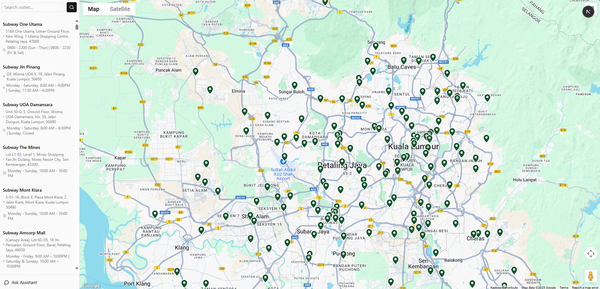

# Subway Finder



A full-stack web application for searching, viewing, and querying Subway outlets in Malaysia, featuring a map interface, outlet search, and an AI-powered chatbot assistant.

---

## Table of Contents

- [Features](#features)
- [Architecture Overview](#architecture-overview)
- [Tech Stack & Key Decisions](#tech-stack--key-decisions)
- [Setup Instructions](#setup-instructions)
  - [1. Supabase Database Setup](#1-supabase-database-setup)
  - [2. Back-End Setup](#2-back-end-setup)
  - [3. Front-End Setup](#3-front-end-setup)
- [Functionality](#functionality)
- [Development Notes](#development-notes)

---

## Features

- **Interactive Map:** View Subway outlets on a Google Map, filter by proximity.
- **Outlet Search:** Search outlets by name/address.
- **Outlet Details:** View address, hours, directions, and nearby outlets.
- **AI Chatbot:** Ask questions about outlets using a RAG (Retrieval-Augmented Generation) chatbot.
- **Admin Scripts:** Scrape and geocode outlet data, sync with Supabase.

---

## Architecture Overview

- **Front-End:** Next.js (React) app for UI, map, and chatbot.
- **Back-End:** FastAPI Python server for API, search, and chatbot endpoint.
- **Database:** Supabase (PostgreSQL) for storing outlet data.
- **Data Pipeline:** Python scripts for scraping and geocoding outlet data.
- **AI Integration:** RAG chatbot using Groq API and Sentence Transformers for semantic search.

---

## Tech Stack & Key Decisions

- **Next.js (React):** Modern, performant, and supports SSR/ISR for scalable UI.
- **FastAPI:** Fast, async Python API with strong typing and easy integration with ML/NLP libraries.
- **Supabase:** Managed PostgreSQL with RESTful API, easy integration, and authentication.
- **Selenium & BeautifulSoup:** Robust web scraping for dynamic content.
- **Google Maps API:** Reliable geocoding and mapping.
- **Sentence Transformers + FAISS:** Efficient semantic search for RAG chatbot.
- **Groq API (Llama 4):** State-of-the-art LLM for natural language answers.

**Reasoning:**

- Chosen for rapid development, strong ecosystem, and easy deployment.
- Python for backend/data pipeline due to rich ML/NLP support.
- Supabase for managed, scalable, and developer-friendly database.

---

## Setup Instructions

### 1. Supabase Database Setup

1. **Create a Supabase Project:**  
   Go to [Supabase](https://supabase.com/) and create a new project.

2. **Create `outlets` Table:**  
   Use the SQL editor or Table UI to create a table named `outlets` with columns:

   ```sql
   CREATE TABLE outlets (
     id BIGSERIAL PRIMARY KEY,
     name TEXT NOT NULL,
     address TEXT NOT NULL,
     operating_hours TEXT,
     waze_link TEXT,
     longitude DOUBLE PRECISION,
     latitude DOUBLE PRECISION,
     CONSTRAINT unique_name_address UNIQUE (name, address)
   );
   ```

3. **Get API Keys:**

   - Go to Project Settings → API.
   - Copy your `SUPABASE_URL` and `SUPABASE_KEY`.

4. **Set Environment Variables:**
   - In both `back-end/.env` and `front-end/.env`, add:
     ```
     SUPABASE_URL=your_supabase_url
     SUPABASE_KEY=your_supabase_key
     ```

### 2. Back-End Setup

1. **Install Python & Dependencies:**

   ```sh
   cd back-end
   python -m venv env
   source env/bin/activate  # or .\env\Scripts\activate on Windows
   pip install -r requirements.txt
   ```

2. **Set Environment Variables:**  
   In `back-end/.env`:

   ```
   SUPABASE_URL=your_supabase_url
   SUPABASE_KEY=your_supabase_key
   GROQ_API_KEY=your_groq_api_key
   GOOGLE_MAPS_API_KEY=your_google_maps_api_key
   ```

3. **Scrape Outlet Data:**  
   Run the scraper to populate the database:

   ```sh
   python scrape.py
   ```

4. **Geocode Outlets:**  
   Run geocoding to add latitude/longitude:

   ```sh
   python geocoding.py
   ```

5. **Start the API Server:**
   ```sh
   uvicorn main:app --reload --port 8000
   ```

### 3. Front-End Setup

1. **Install Node.js dependencies:**

   ```sh
   cd front-end
   npm install
   ```

2. **Set Environment Variables:**  
   In `front-end/.env`:

   ```
   NEXT_PUBLIC_API_BASE=http://localhost:8000
   NEXT_PUBLIC_GOOGLE_MAPS_API_KEY=your_google_maps_api_key
   ```

3. **Run the Development Server:**
   ```sh
   npm run dev
   ```
   Open [http://localhost:3000](http://localhost:3000) in your browser.

---

## Functionality

- **Browse Outlets:**  
  See all Subway outlets on a map and in a searchable sidebar.

- **Outlet Details:**  
  Click an outlet to view details, operating hours, and get Waze directions.

- **Nearby Outlets:**  
  Adjust the radius slider to see other outlets within a chosen distance.

- **Chatbot:**  
  Use the "Ask Assistant" feature to ask questions about outlets (e.g., "Which outlets are open late?").

---

## Development Notes

- **Front-End:**

  - Located in [`front-end/`](front-end)
  - Main entry: [`src/app/page.tsx`](front-end/src/app/page.tsx)
  - Uses Tailwind CSS, Radix UI, and Lucide icons.

- **Back-End:**

  - Located in [`back-end/`](back-end)
  - Main API: [`main.py`](back-end/main.py)
  - Scraper: [`scrape.py`](back-end/scrape.py)
  - Geocoding: [`geocoding.py`](back-end/geocoding.py)

- **API Endpoints:**

  - `GET /outlets` — List all outlets.
  - `GET /outlets/nearby?latitude=...&longitude=...&distance_km=...` — Find outlets within radius via Haversine formula.
  - `POST /chat-completion` — RAG chatbot for outlet Q&A.

- **Environment Variables:**  
  Store all secrets in `.env` files (never commit them).

---

## License

MIT License. See [LICENSE](LICENSE) for details.

---

## Contact

For questions or contributions, please open an issue or pull request.
